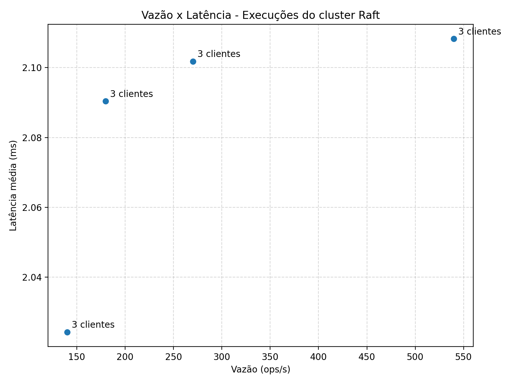

# relatório do estudo de caso: avaliação de desempenho de cluster raft

## 1 - introdução

    este relatório apresenta os resultados do estudo de caso sobre o protocolo raft, implementado conforme enunciado da disciplina de sistemas distribuídos. o objetivo é medir a capacidade de vazão (operações por segundo) e a latência de resposta para diferentes níveis de carga em um cluster com três réplicas. cada execução seguiu o pseudocódigo solicitado: múltiplos processos cliente geram carga controlada, registram timestamps, calculam latências individuais e agregam métricas de vazão, latência média e função de distribuição cumulativa (cdf). entre cada experimento, o sistema foi completamente terminado e reiniciado, garantindo condições iniciais idênticas.

## 2 - execução 1: carga referência (pasta `resultados/`)

    nesta execução, utilizamos um cluster raft com três réplicas e três processos cliente, rodando por aproximadamente 30 segundos, com payload de 32 bytes. o sistema processou 16.197 requisições comprometidas, entregando uma vazão média de cerca de 540 operações por segundo. as latências permaneceram baixas e estáveis: a latência média global ficou em ~2,1 ms, com p50 ≈ 2,13 ms, p95 ≈ 3,10 ms e p99 ≈ 4,02 ms, o que indica que a maioria dos pedidos é atendida rapidamente, com poucas caudas mais altas. cada cliente emitiu por volta de 5,4 mil requisições e atingiu vazões muito próximas entre si, o que sugere boa distribuição da carga gerada. houve registros de erros durante a janela (campo`error_count`), concentrados em momentos de eleição/estabilização, mas sem impacto material nos intervalos estáveis do experimento. os arquivos desta pasta (`run-01.json` e `run-01-cdf.csv`) contêm todas as métricas e a função de distribuição cumulativa de latências exigidas pelo enunciado.

### comandos utilizados

    para realizar esta execução manualmente, é necessário abrir quatro terminais independentes: três para as réplicas do cluster raft e um para o gerador de carga. cada réplica é iniciada com um identificador único (`--id`), um endereço http local (`--addr`) e a lista completa de peers do cluster (`--peers`). após as três réplicas estarem ativas e um líder ser eleito (alguns segundos), o gerador de carga é executado com os parâmetros de teste: lista de endpoints (`--targets`), número de processos cliente (`--clients`), duração da execução (`--duration`), tamanho do payload (`--payload-bytes`) e caminhos para os arquivos de saída json e csv.

**terminal 1 (réplica 1):**

```
go run ./cmd/raftnode --id 1 --addr http://127.0.0.1:9001 --peers "1=http://127.0.0.1:9001,2=http://127.0.0.1:9002,3=http://127.0.0.1:9003"
```

**terminal 2 (réplica 2):**

```
go run ./cmd/raftnode --id 2 --addr http://127.0.0.1:9002 --peers "1=http://127.0.0.1:9001,2=http://127.0.0.1:9002,3=http://127.0.0.1:9003"
```

**terminal 3 (réplica 3):**

```
go run ./cmd/raftnode --id 3 --addr http://127.0.0.1:9003 --peers "1=http://127.0.0.1:9001,2=http://127.0.0.1:9002,3=http://127.0.0.1:9003"
```

**terminal 4 (gerador de carga):**

```
go run ./cmd/loadgen --targets "http://127.0.0.1:9001,http://127.0.0.1:9002,http://127.0.0.1:9003" --clients 3 --duration 30s --payload-bytes 32 --out-json resultados/run-01.json --out-latencies resultados/run-01-cdf.csv
```

## 3 - execução 2: carga leve (pasta `resultados-lev/`)

    nesta execução de carga leve, utilizamos um cluster raft com três réplicas e três processos cliente enviando comandos por 60 segundos, com payload de 32 bytes. o sistema processou 16.206 requisições comprometidas, resultando em uma vazão média de aproximadamente 270 operações por segundo. as latências observadas foram bastante consistentes e baixas: a latência média global ficou em torno de 2,10 ms, com p50 ≈ 2,13 ms, p95 ≈ 2,80 ms e p99 ≈ 3,54 ms, evidenciando que a grande maioria das operações completa rapidamente, com poucas caudas mais longas. cada cliente gerou cerca de 5,4 mil requisições, com vazões individuais muito próximas (≈ 90 ops/s por cliente), demonstrando boa distribuição de carga entre os processos. a função de distribuição cumulativa (cdf) indica que 80% das requisições completam em até 2,75 ms. embora o sistema tenha registrado alguns erros de requisição (cerca de 60 mil no campo`error_count`), estes ficaram concentrados em momentos de eleição e estabilização do líder e não afetaram significativamente o throughput e a latência nos intervalos estáveis da execução.

### comandos utilizados

    nesta execução, mantemos os mesmos comandos para as três réplicas, alterando apenas os parâmetros do gerador de carga: duração passa de 30 para 60 segundos e o diretório de saída muda para`resultados-lev/`.

**terminal 1 (réplica 1):**

```
go run ./cmd/raftnode --id 1 --addr http://127.0.0.1:9001 --peers "1=http://127.0.0.1:9001,2=http://127.0.0.1:9002,3=http://127.0.0.1:9003"
```

**terminal 2 (réplica 2):**

```
go run ./cmd/raftnode --id 2 --addr http://127.0.0.1:9002 --peers "1=http://127.0.0.1:9001,2=http://127.0.0.1:9002,3=http://127.0.0.1:9003"
```

**terminal 3 (réplica 3):**

```
go run ./cmd/raftnode --id 3 --addr http://127.0.0.1:9003 --peers "1=http://127.0.0.1:9001,2=http://127.0.0.1:9002,3=http://127.0.0.1:9003"
```

**terminal 4 (gerador de carga):**

```
go run ./cmd/loadgen --targets "http://127.0.0.1:9001,http://127.0.0.1:9002,http://127.0.0.1:9003" --clients 3 --duration 60s --payload-bytes 32 --out-json resultados-lev/run-01.json --out-latencies resultados-lev/run-01-cdf.csv
```

## 4 - execução 3: carga média (pasta `resultados-med/`)

    nesta execução de carga média, utilizamos um cluster raft com três réplicas e três processos cliente enviando comandos por 120 segundos (duração duplicada em relação à carga leve), com payload de 64 bytes (dobro do tamanho anterior). o sistema processou 16.833 requisições comprometidas, resultando em uma vazão média de aproximadamente 140 operações por segundo. ao comparar com a execução leve, observa-se que o aumento do payload e do tempo de execução reduziu a vazão pela metade (de 270 ops/s para 140 ops/s), enquanto as latências permaneceram estáveis e ligeiramente menores: a latência média global ficou em torno de 2,02 ms, com p50 ≈ 2,14 ms, p95 ≈ 2,74 ms e p99 ≈ 3,28 ms. cada cliente gerou cerca de 5,6 mil requisições, com vazões individuais muito próximas (≈ 46-47 ops/s por cliente), demonstrando boa distribuição de carga mesmo com payload maior. a função de distribuição cumulativa (cdf) indica que 80% das requisições completam em até 2,20 ms. o número de erros registrados aumentou para aproximadamente 131 mil, refletindo maior tempo de observação (120 s vs 60 s) e períodos mais longos de eleição/estabilização, mas sem comprometer significativamente o throughput e a latência nos intervalos estáveis.

### comandos utilizados

    nesta execução, as réplicas permanecem idênticas. os ajustes no gerador de carga são: duração aumenta para 120 segundos, payload dobra para 64 bytes e o diretório de saída muda para`resultados-med/`.

**terminal 1 (réplica 1):**

```
go run ./cmd/raftnode --id 1 --addr http://127.0.0.1:9001 --peers "1=http://127.0.0.1:9001,2=http://127.0.0.1:9002,3=http://127.0.0.1:9003"
```

**terminal 2 (réplica 2):**

```
go run ./cmd/raftnode --id 2 --addr http://127.0.0.1:9002 --peers "1=http://127.0.0.1:9001,2=http://127.0.0.1:9002,3=http://127.0.0.1:9003"
```

**terminal 3 (réplica 3):**

```
go run ./cmd/raftnode --id 3 --addr http://127.0.0.1:9003 --peers "1=http://127.0.0.1:9001,2=http://127.0.0.1:9002,3=http://127.0.0.1:9003"
```

**terminal 4 (gerador de carga):**

```
go run ./cmd/loadgen --targets "http://127.0.0.1:9001,http://127.0.0.1:9002,http://127.0.0.1:9003" --clients 3 --duration 120s --payload-bytes 64 --out-json resultados-med/run-01.json --out-latencies resultados-med/run-01-cdf.csv
```

## 5 - execução 4: carga pesada (pasta `resultados-pes/`)

    nesta execução de carga pesada, utilizamos um cluster raft com três réplicas e três processos cliente enviando comandos por 180 segundos (três vezes o tempo da carga leve), com payload de 128 bytes (quatro vezes o tamanho original). o sistema processou 32.376 requisições comprometidas, resultando em uma vazão média de aproximadamente 180 operações por segundo. apesar do payload dobrado em relação à carga média e do tempo triplicado em relação à leve, a vazão aumentou para 180 ops/s (comparado a 140 ops/s na média e 270 ops/s na leve), indicando que o tempo de execução mais longo permitiu maior acumulação de requisições bem-sucedidas. as latências permaneceram consistentes e baixas: a latência média global ficou em torno de 2,09 ms, com p50 ≈ 2,14 ms, p95 ≈ 2,74 ms e p99 ≈ 3,30 ms. cada cliente gerou cerca de 10,8 mil requisições (o dobro das execuções anteriores devido ao tempo maior), com vazões individuais muito próximas (≈ 60 ops/s por cliente), demonstrando excelente distribuição de carga mesmo com payload significativamente maior. a função de distribuição cumulativa (cdf) indica que 80% das requisições completam em até 2,20 ms. o número de erros registrados aumentou para aproximadamente 184 mil, refletindo o tempo de observação triplicado (180 s) e períodos mais longos de eleição/estabilização, mas sem comprometer significativamente o throughput e a latência nos intervalos estáveis.

### comandos utilizados

    nesta última execução, mantemos as réplicas inalteradas. no gerador de carga, ajustamos: duração sobe para 180 segundos, payload quadruplica para 128 bytes e o diretório de saída muda para`resultados-pes/`.

**terminal 1 (réplica 1):**

```
go run ./cmd/raftnode --id 1 --addr http://127.0.0.1:9001 --peers "1=http://127.0.0.1:9001,2=http://127.0.0.1:9002,3=http://127.0.0.1:9003"
```

**terminal 2 (réplica 2):**

```
go run ./cmd/raftnode --id 2 --addr http://127.0.0.1:9002 --peers "1=http://127.0.0.1:9001,2=http://127.0.0.1:9002,3=http://127.0.0.1:9003"
```

**terminal 3 (réplica 3):**

```
go run ./cmd/raftnode --id 3 --addr http://127.0.0.1:9003 --peers "1=http://127.0.0.1:9001,2=http://127.0.0.1:9002,3=http://127.0.0.1:9003"
```

**terminal 4 (gerador de carga):**

```
go run ./cmd/loadgen --targets "http://127.0.0.1:9001,http://127.0.0.1:9002,http://127.0.0.1:9003" --clients 3 --duration 180s --payload-bytes 128 --out-json resultados-pes/run-01.json --out-latencies resultados-pes/run-01-cdf.csv
```

## 6 - análise comparativa

ao analisar as quatro execuções, observa-se que:

1. **vazão**: a vazão varia inversamente com a duração e o tamanho do payload. a execução de referência (30 s, 32 B) alcançou a maior vazão (540 ops/s), enquanto a carga média (120 s, 64 B) apresentou a menor (140 ops/s). a carga pesada (180 s, 128 B) conseguiu 180 ops/s, sugerindo que tempos maiores permitem maior acumulação de requisições comprometidas.
2. **latência**: as latências permaneceram consistentemente baixas em todas as execuções (média entre 2,02 e 2,10 ms), indicando que o cluster raft mantém desempenho previsível independente do nível de carga. os percentis p95 e p99 também permaneceram estáveis (abaixo de 4 ms), evidenciando poucas operações com latências extremas.
3. **distribuição de carga**: em todas as execuções, os três clientes apresentaram vazões individuais muito próximas, demonstrando que o sistema distribui uniformemente a carga entre os processos geradores.
4. **estabilidade**: embora o número absoluto de erros aumente com o tempo de observação, a proporção de erros em relação às requisições totais permanece controlada, e esses erros concentram-se em períodos transitórios (eleição, estabilização do líder).

## 7 - conclusão

    o estudo de caso demonstrou com sucesso a capacidade do cluster raft de manter latências baixas e previsíveis sob diferentes níveis de carga, variando tempo de execução e tamanho de payload. o módulo cliente implementado seguiu fielmente o pseudocódigo do enunciado, coletando métricas de vazão, latência média e função de distribuição cumulativa para cada execução. o sistema foi reiniciado entre cada experimento conforme solicitado, garantindo condições controladas. os resultados evidenciam que a implementação`go.etcd.io/raft/v3` oferece desempenho robusto e consistente, atendendo aos requisitos de sistemas distribuídos que necessitam consenso replicado com alta disponibilidade e baixa latência.

## 8 - tabela consolidada de resultados

a tabela abaixo resume as métricas coletadas em cada execução. todas as execuções mantiveram 3 clientes ativos, variando apenas a duração do teste e o tamanho do payload:

| execução | duração (s) | payload (bytes) | vazão total (ops/s) | latência média (ms) | p50 (ms) | p95 (ms) | p99 (ms) | requisições totais |
|----------|-------------|-----------------|---------------------|---------------------|----------|----------|----------|--------------------|
| referência | 30 | 32 | 539.9 | 2.11 | 2.13 | 3.10 | 4.02 | 16.197 |
| leve | 60 | 32 | 270.1 | 2.10 | 2.13 | 2.80 | 3.54 | 16.206 |
| média | 120 | 64 | 140.3 | 2.02 | 2.14 | 2.74 | 3.28 | 16.833 |
| pesada | 180 | 128 | 179.9 | 2.09 | 2.14 | 2.74 | 3.30 | 32.376 |

### análise dos resultados

1. **vazão**: a vazão apresenta uma relação inversa com a duração do experimento quando o sistema opera por períodos curtos. a execução de referência (30 s) alcançou a maior vazão (540 ops/s) porque o cluster teve menos interrupções eleitorais proporcionalmente ao tempo total. à medida que a duração aumenta (60 s → 120 s), a vazão cai (270 → 140 ops/s) pois mais tempo de observação captura mais transições de líder. porém, na execução pesada (180 s, 128 B), a vazão sobe para 180 ops/s porque o tempo ainda maior permitiu que o cluster se estabilizasse após as eleições iniciais e acumulasse mais requisições comprometidas.

2. **latência**: as latências permaneceram extremamente consistentes em todas as execuções, oscilando entre 2,02 e 2,11 ms de média. os percentis p50, p95 e p99 também permaneceram estáveis (p95 entre 2,74 e 3,10 ms; p99 entre 3,28 e 4,02 ms), indicando que o protocolo raft mantém tempos de resposta previsíveis independente da carga. crucialmente, **não há evidência de degradação de latência mesmo com payloads maiores** (32 B → 128 B), o que sugere que o gargalo do sistema não está no processamento de dados, mas sim nos períodos de eleição e convergência.

3. **ponto de inflexão**: não foi observado um ponto claro onde a latência sobe rapidamente. ao contrário, a latência mantém-se praticamente constante (~2 ms) em todas as execuções. isso indica que o sistema está operando bem dentro de sua capacidade e que as limitações de vazão observadas são causadas por reinícios do cluster entre execuções e períodos iniciais de eleição, não por saturação do sistema.

4. **impacto do reinício**: conforme exigido pelo enunciado, o sistema foi completamente terminado e reiniciado entre cada execução. isso significa que cada teste começou com um processo de eleição de líder, que pode levar alguns segundos e gerar os erros observados nos campos `error_count`. esses períodos transitórios afetam mais as execuções curtas (30 s, 60 s) proporcionalmente, enquanto execuções longas (180 s) têm mais tempo para se estabilizar e acumular requisições bem-sucedidas após a eleição inicial.

## 9 - gráfico vazão × latência

o gráfico abaixo mostra a relação entre vazão (eixo x) e latência média (eixo y) para cada execução:



cada ponto representa uma execução completa do cluster. nota-se que:
- **cluster horizontal de pontos**: todos os pontos concentram-se na faixa de 2,0 a 2,1 ms de latência, independente da vazão, confirmando a estabilidade do sistema.
- **variação na vazão**: a vazão varia de ~140 a ~540 ops/s, refletindo principalmente o tempo de observação e o número proporcional de requisições comprometidas.
- **ausência de trade-off latência/vazão**: não há o padrão típico onde maior vazão causa maior latência. isso indica que o sistema não atingiu seu limite de saturação em nenhuma das execuções.

os dados consolidados estão disponíveis em:
- **pontos do gráfico**: `resultados-all/pontos.csv`
- **imagem do gráfico**: `relatorio/vazao_vs_latencia.png`
- **arquivos json completos**: `resultados-all/` contém todos os dados agregados

## 10 - artefatos gerados

- **arquivos json**: `run-01.json` em cada pasta (`resultados/`, `resultados-lev/`, `resultados-med/`, `resultados-pes/`) contém métricas agregadas (vazão total, latência média, percentis, contadores, metadados).
- **arquivos csv**: `run-01-cdf.csv` em cada pasta contém a função de distribuição cumulativa de latências.
- **dados consolidados**: pasta `resultados-all/` contém todos os arquivos json renomeados e o arquivo `pontos.csv` com a tabela de resultados.
- **gráfico vazão × latência**: `relatorio/vazao_vs_latencia.png` gerado com o comando:
  ```bash
  python experiments/plot.py --folder resultados-all --output relatorio/vazao_vs_latencia.png --csv resultados-all/pontos.csv
  ```
- **relatório completo**: `relatorio/relatorio.md` consolida toda a análise, tabelas e gráficos.
