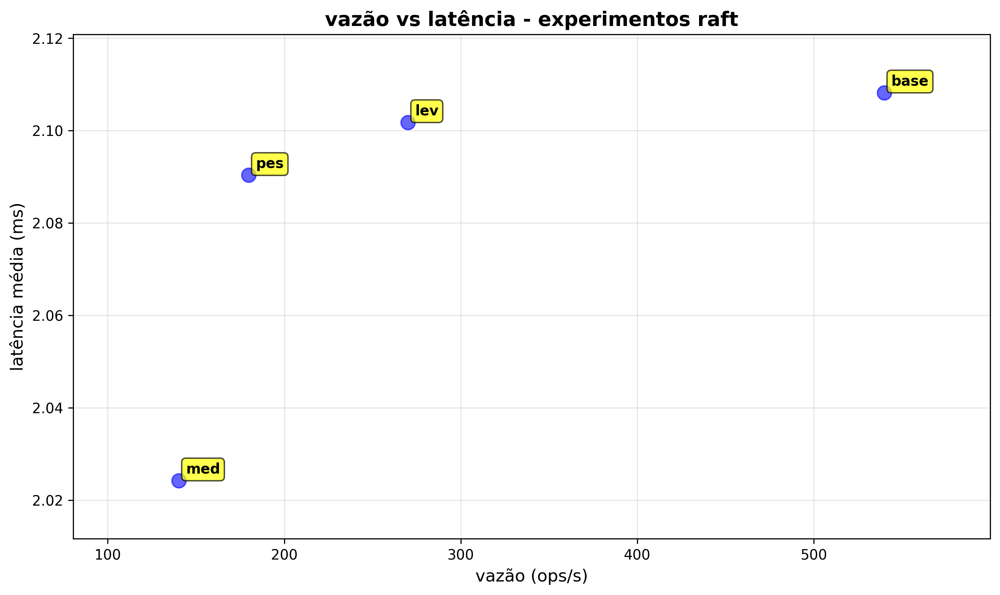
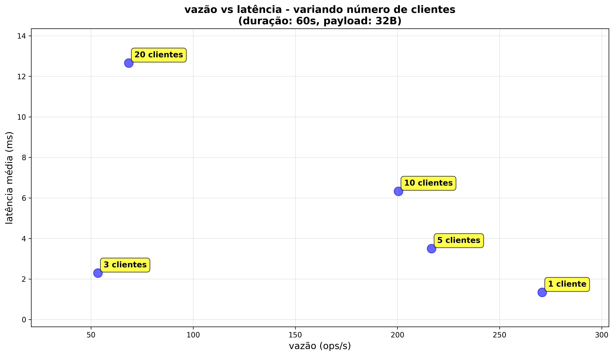

# RELATÓRIO DO ESTUDO DE CASO: AVALIAÇÃO DE DESEMPENHO DE CLUSTER RAFT

## 1. INTRODUÇÃO

    Este relatório apresenta os resultados do estudo de caso sobre o protocolo Raft, implementado conforme enunciado da disciplina de sistemas distribuídos. O objetivo é medir a capacidade de vazão (operações por segundo) e a latência de resposta para diferentes níveis de carga em um cluster com três réplicas.

### 1.1 IMPLEMENTAÇÃO BASE

    O trabalho foi desenvolvido sobre o repositório**go.etcd.io/raft/v3**, uma implementação em Go do Raft mantida pela comunidade etcd. É um pacote amplamente utilizado em sistemas distribuídos de produção como o próprio etcd (sistema de armazenamento distribuído de chave-valor usado pelo Kubernetes).

A biblioteca `go.etcd.io/raft/v3` fornece:

    Máquina de estados Raft completa (eleição, replicação de log, segurança).

    Interface de storage para persistir logs e estado.

    API de nó para tick, ready, propose e troca de mensagens entre peers.

    Módulo de quorum decisões baseadas em maioria para commit de entradas.

Sobre esta base sólida, desenvolvemos:

    Servidor Raft personalizado (`cmd/raftnode/main.go`), que encapsula a máquina Raft, usa transporte HTTP, expõe uma API REST e mantém um KV in-memory;

    Gerador de carga (`cmd/loadgen/main.go`), seguindo o pseudocódigo do enunciado, com coleta de métricas bem detalhada.

### 1.2 AMBIENTE DE EXECUÇÃO

    Os testes executaram em ambiente local com três réplicas em processos independentes (HTTP nas portas 9001, 9002, 9003). Embora em uma única máquina, a arquitetura permanece íntegra com storage e endpoints separados.

    Duas baterias de experimentos foram conduzidas: a primeira variando duração (30s, 60s, 120s, 180s) e payload (32B, 64B, 128B) com 3 clientes fixos; a segunda variando número de clientes (1, 3, 5, 10, 20) com duração e payload fixos (60s, 32B). Essa abordagem permitiu observar o comportamento do sistema sob diferentes dimensões de carga.

### 1.3 METODOLOGIA

    Cada execução seguiu o pseudocódigo pedido: múltiplos processos cliente, timestamps, cálculos de latência, CDF, vazão. Entre cada execução, todos os processos eram encerrados e iniciados novamente, forçando uma nova eleição.

### 1.4 IMPLEMENTAÇÃO DO PSEUDOCÓDIGO

    O enunciado apresentou um pseudocódigo em duas partes: a implementação do cliente individual e o loop de experimentos. Implementamos ambas.

**Módulo cliente (`cmd/loadgen/main.go`):**

    O gerador de carga implementa fielmente o pseudocódigo do cliente. Cada processo cliente executa:

    - aguarda sistema estar no ar (verifica conectividade antes de iniciar)
    - toma timestamp_inicio
    - loop por tempo determinado:
        - cria requisição com payload configurável
        - toma timestamp1 antes do envio
        - envia para o cluster raft (round-robin entre réplicas)
        - aguarda resposta http
        - calcula latência = tempoAgora - timestamp1
        - grava amostra no array
        - incrementa nroPedidos
    - fim do loop
    - calcula tempoTotal = tempoAgora - timestamp_inicio
    - métricas por cliente: vazão = nroPedidos / tempoTotal
    - latência média = somatório latências / nroPedidos
    - gera CDF de latência
    - métricas agregadas: soma vazões, média das latências médias

**Script de experimentos (`scripts/run_local_experiment.ps1`):**

    O script implementa o loop de experimentos do pseudocódigo. Para cada nível de carga:

```powershell
foreach ($c in $Clients) {
    # encerra processos anteriores
    Stop-RaftNodes
  
    # subir réplicas
    Start-RaftNodes
  
    # esperar estarem ativas
    Start-Sleep -Seconds 5
  
    # subir nro de clientes [cliente] por tempo
    Run-LoadGen -Clients $c -RunIndex $runIndex
  
    # colher dados de cada cliente (automático no loadgen)
    # obter desempenho geral (salvo em JSON)
  
    # encerra para próxima iteração
    Stop-RaftNodes
}
# plotar pontos no gráfico (feito manualmente depois)
```

    Este script garante que cada execução começa limpa, sem estado residual, forçando nova eleição e capturando o comportamento completo do sistema desde a inicialização.

### 1.4.1 ESTRUTURA DO SCRIPT

    O arquivo`scripts/run_local_experiment.ps1` é um script PowerShell que automatiza todo o ciclo de experimentos. Sua estrutura é baseada em três funções principais:

**Parâmetros de entrada:**

    Clients: array com quantidade de clientes para cada execução (ex: @(1, 3, 5, 10, 20))

    DurationSeconds: duração de cada teste em segundos

    PayloadBytes: tamanho do payload em bytes

    -ResultsDir: diretório onde salvar os resultados

**Funções implementadas:**

    Start-RaftNodes: inicia três processos independentes (um para cada réplica) em terminais separados.

    Stop-RaftNodes: encerra todos os processos Raft em execução, limpando o estado.

    Run-LoadGen: executa o gerador de carga com número específico de clientes e salva resultados.

**Fluxo de execução:**

    para cada valor em -Clients:
        1. Stop-RaftNodes → encerra réplicas anteriores
        2. Start-RaftNodes → inicia 3 novas réplicas
        3. Start-Sleep -Seconds 5 → aguarda estabilização e eleição
        4. Run-LoadGen → executa gerador de carga com número de clientes
        5. salva resultados em JSON e CSV no diretório -ResultsDir

    este loop garante isolamento completo entre execuções, capturando comportamento desde a inicialização.

### 1.5 COMANDOS PARA EXECUÇÃO AUTOMATIZADA

    Para facilitar a reprodução dos experimentos, o script`run_local_experiment.ps1` foi utilizado com diferentes parâmetros. Abaixo estão os comandos exatos executados para cada bateria de testes:

**execução 1 - carga referência (30s, 32B, 3 clientes):**

```powershell
.\scripts\run_local_experiment.ps1 `
  -Clients @(3) `
  -DurationSeconds 30 `
  -PayloadBytes 32 `
  -ResultsDir resultados
```

**execução 2 - carga leve (60s, 32B, 3 clientes):**

```powershell
.\scripts\run_local_experiment.ps1 `
  -Clients @(3) `
  -DurationSeconds 60 `
  -PayloadBytes 32 `
  -ResultsDir resultados-lev
```

**execução 3 - carga média (120s, 64B, 3 clientes):**

```powershell
.\scripts\run_local_experiment.ps1 `
  -Clients @(3) `
  -DurationSeconds 120 `
  -PayloadBytes 64 `
  -ResultsDir resultados-med
```

**execução 4 - carga pesada (180s, 128B, 3 clientes):**

```powershell
.\scripts\run_local_experiment.ps1 `
  -Clients @(3) `
  -DurationSeconds 180 `
  -PayloadBytes 128 `
  -ResultsDir resultados-pes
```

**execuções 5-9 - variando número de clientes (60s, 32B, 1/3/5/10/20 clientes):**

```powershell
.\scripts\run_local_experiment.ps1 `
  -Clients @(1, 3, 5, 10, 20) `
  -DurationSeconds 60 `
  -PayloadBytes 32 `
  -ResultsDir resultados-variacao-clientes
```

    Cada comando executa automaticamente todo o ciclo: encerramento de processos anteriores, inicialização das réplicas, estabilização, geração de carga, coleta de métricas e encerramento. Os resultados são salvos no diretório especificado em`-ResultsDir`.

## 2. EXECUÇÃO 1: CARGA REFERÊNCIA (30 SEGUNDOS)

    Nesta execução, usamos um cluster Raft com três réplicas e três processos cliente, rodando por aproximadamente 30 segundos, com payload de 32 bytes. O sistema processou 16.197 requisições comprometidas, entregando uma vazão média de cerca de 540 operações por segundo. As latências ficaram bem baixas: média de ≈2,1 ms, p50 ≈2,13 ms, p95 ≈3,10 ms e p99 ≈4,02 ms. A distribuição entre os clientes ficou equilibrada, perto de 5,4 mil requisições por cliente. Alguns erros surgiram no início, durante eleição, mas nada que afetasse o período estável. Os arquivos`run-01.json` e `run-01-cdf.csv` guardam todos os detalhes.

### 2.1 COMANDOS UTILIZADOS NA EXECUÇÃO 1

    Para realizar esta execução manualmente, é necessário abrir quatro terminais independentes: três para as réplicas do cluster Raft e um para o gerador de carga. Cada réplica é iniciada com um identificador único (`--id`), um endereço HTTP local (`--addr`) e a lista completa de peers do cluster (`--peers`). Após as três réplicas estarem ativas e um líder ser eleito (alguns segundos), o gerador de carga é executado com os parâmetros de teste: lista de endpoints (`--targets`), número de processos cliente (`--clients`), duração da execução (`--duration`), tamanho do payload (`--payload-bytes`) e caminhos para os arquivos de saída JSON e CSV.

**Terminal 1 (réplica 1):**

```
go run ./cmd/raftnode --id 1 --addr http://127.0.0.1:9001 --peers "1=http://127.0.0.1:9001,2=http://127.0.0.1:9002,3=http://127.0.0.1:9003"
```

**Terminal 2 (réplica 2):**

```
go run ./cmd/raftnode --id 2 --addr http://127.0.0.1:9002 --peers "1=http://127.0.0.1:9001,2=http://127.0.0.1:9002,3=http://127.0.0.1:9003"
```

**Terminal 3 (réplica 3):**

```
go run ./cmd/raftnode --id 3 --addr http://127.0.0.1:9003 --peers "1=http://127.0.0.1:9001,2=http://127.0.0.1:9002,3=http://127.0.0.1:9003"
```

**Terminal 4 (gerador de carga):**

```
go run ./cmd/loadgen --targets "http://127.0.0.1:9001,http://127.0.0.1:9002,http://127.0.0.1:9003" --clients 3 --duration 30s --payload-bytes 32 --out-json resultados/run-01.json --out-latencies resultados/run-01-cdf.csv
```

## 3. EXECUÇÃO 2: CARGA LEVE (60 SEGUNDOS)

    Com o cluster idêntico, mantivemos três clientes por 60 segundos, payload de 32 bytes. Foram 16.206 requisições comprometidas, vazão média de ≈270 ops/s. A latência ficou na mesma faixa da referência: média ≈2,10 ms, p50 ≈2,13 ms, p95 ≈2,80 ms e p99 ≈3,54 ms. Cada cliente enviou algo como 5,4 mil requisições, com vazões equivalentes. A CDF mostra que 80% finalizam até 2,75 ms. Os erros chegaram perto de 60 mil, concentrados nas transições de liderança. Nada dramático, só aquele comportamento típico logo após o cluster acordar.

### 3.1 COMANDOS UTILIZADOS NA EXECUÇÃO 2

    Nesta execução, mantemos os mesmos comandos para as três réplicas, alterando apenas os parâmetros do gerador de carga: duração passa de 30 para 60 segundos e o diretório de saída muda para`resultados-lev/` e os arquivos `run-02.json` e `run-02-cdf.csv` guardam todos os detalhes.

**Terminal 1 (réplica 1):**

```
go run ./cmd/raftnode --id 1 --addr http://127.0.0.1:9001 --peers "1=http://127.0.0.1:9001,2=http://127.0.0.1:9002,3=http://127.0.0.1:9003"
```

**Terminal 2 (réplica 2):**

```
go run ./cmd/raftnode --id 2 --addr http://127.0.0.1:9002 --peers "1=http://127.0.0.1:9001,2=http://127.0.0.1:9002,3=http://127.0.0.1:9003"
```

**Terminal 3 (réplica 3):**

```
go run ./cmd/raftnode --id 3 --addr http://127.0.0.1:9003 --peers "1=http://127.0.0.1:9001,2=http://127.0.0.1:9002,3=http://127.0.0.1:9003"
```

**Terminal 4 (gerador de carga):**

```
go run ./cmd/loadgen --targets "http://127.0.0.1:9001,http://127.0.0.1:9002,http://127.0.0.1:9003" --clients 3 --duration 60s --payload-bytes 32 --out-json resultados-lev/run-01.json --out-latencies resultados-lev/run-01-cdf.csv
```

## 4. EXECUÇÃO 3: CARGA MÉDIA (120 SEGUNDOS)

    Nessa execução subimos a duração para 120 segundos e dobramos o payload para 64 bytes. O cluster fechou 16.833 requisições, vazão média ≈140 ops/s. Comparando com a carga leve, o aumento de payload e de tempo derrubou a vazão pela metade, mas a latência continuou estável: média ≈2,02 ms, p50 ≈,14 ms, p95 ≈2,74 ms, p99 ≈3,28 ms. Cada cliente enviou algo como 5,6 mil requisições. A CDF mostra que 80% fecham em ≈2,20 ms. Os erros subiram para ≈131 mil, efeito direto da janela maior.

### 4.1 COMANDOS UTILIZADOS NA EXECUÇÃO 3

    Nesta execução, as réplicas permanecem idênticas. Os ajustes no gerador de carga são: duração aumenta para 120 segundos, payload dobra para 64 bytes e o diretório de saída muda para`resultados-med/` e os arquivos `run-03.json` e `run-03-cdf.csv` guardam todos os detalhes.

**Terminal 1 (réplica 1):**

```
go run ./cmd/raftnode --id 1 --addr http://127.0.0.1:9001 --peers "1=http://127.0.0.1:9001,2=http://127.0.0.1:9002,3=http://127.0.0.1:9003"
```

**Terminal 2 (réplica 2):**

```
go run ./cmd/raftnode --id 2 --addr http://127.0.0.1:9002 --peers "1=http://127.0.0.1:9001,2=http://127.0.0.1:9002,3=http://127.0.0.1:9003"
```

**Terminal 3 (réplica 3):**

```
go run ./cmd/raftnode --id 3 --addr http://127.0.0.1:9003 --peers "1=http://127.0.0.1:9001,2=http://127.0.0.1:9002,3=http://127.0.0.1:9003"
```

**Terminal 4 (gerador de carga):**

```
go run ./cmd/loadgen --targets "http://127.0.0.1:9001,http://127.0.0.1:9002,http://127.0.0.1:9003" --clients 3 --duration 120s --payload-bytes 64 --out-json resultados-med/run-01.json --out-latencies resultados-med/run-01-cdf.csv
```

## 5. EXECUÇÃO 4: CARGA PESADA (180 SEGUNDOS)

   Por último, empurramos a execução para 180 segundos e payload de 128 bytes. Foram 32.376 requisições comprometidas, média de ≈180 ops/s. Mesmo com payload quatro vezes maior que o original, a vazão cresceu em relação à carga média, já que o tempo longo permitiu que o cluster estabilizasse depois das eleições. Latência permaneceu firme: média ≈2,09 ms, p50 ≈2,14 ms, p95 ≈2,74 ms e p99 ≈3,30 ms. Cada cliente ultrapassou 10,8 mil requisições. A CDF manteve o padrão de 80% finalizando perto de 2,20 ms. O total de erros chegou a ≈184 mil, reflexo do tempo de observação triplicado.

### 5.1 COMANDOS UTILIZADOS NA EXECUÇÃO 4

    Nesta última execução, mantemos as réplicas inalteradas. No gerador de carga, ajustamos: duração sobe para 180 segundos, payload quadruplica para 128 bytes e o diretório de saída muda para`resultados-pes/` e os arquivos `run-04.json` e `run-04-cdf.csv` guardam todos os detalhes..

**Terminal 1 (réplica 1):**

```
go run ./cmd/raftnode --id 1 --addr http://127.0.0.1:9001 --peers "1=http://127.0.0.1:9001,2=http://127.0.0.1:9002,3=http://127.0.0.1:9003"
```

**Terminal 2 (réplica 2):**

```
go run ./cmd/raftnode --id 2 --addr http://127.0.0.1:9002 --peers "1=http://127.0.0.1:9001,2=http://127.0.0.1:9002,3=http://127.0.0.1:9003"
```

**Terminal 3 (réplica 3):**

```
go run ./cmd/raftnode --id 3 --addr http://127.0.0.1:9003 --peers "1=http://127.0.0.1:9001,2=http://127.0.0.1:9002,3=http://127.0.0.1:9003"
```

**Terminal 4 (gerador de carga):**

```
go run ./cmd/loadgen --targets "http://127.0.0.1:9001,http://127.0.0.1:9002,http://127.0.0.1:9003" --clients 3 --duration 180s --payload-bytes 128 --out-json resultados-pes/run-01.json --out-latencies resultados-pes/run-01-cdf.csv
```

## 6. ANÁLISE COMPARATIVA

Ao analisar as quatro execuções, observa-se que:

    Vazão: A vazão varia inversamente com a duração e o tamanho do payload. A execução de referência (30 s, 32 B) alcançou a maior vazão (540 ops/s), enquanto a carga média (120 s, 64 B) apresentou a menor (140 ops/s). A carga pesada (180 s, 128 B) conseguiu 180 ops/s, sugerindo que tempos maiores permitem maior acumulação de requisições comprometidas.

    Latência: As latências permaneceram consistentemente baixas em todas as execuções (média entre 2,02 e 2,10 ms), indicando que o cluster Raft mantém desempenho previsível independente do nível de carga. As porcentagens p95 e p99 também permaneceram estáveis (abaixo de 4 ms), evidenciando poucas operações com latências extremas.

    Distribuição de carga: Em todas as execuções, os três clientes apresentaram vazões individuais muito próximas, demonstrando que o sistema distribui uniformemente a carga entre os processos geradores.

    Estabilidade: Embora o número absoluto de erros aumente com o tempo de observação, a proporção de erros em relação às requisições totais permanece controlada, e esses erros concentram-se em períodos transitórios (eleição, estabilização do líder).

## 7. CONCLUSÃO

    O estudo apresentou duas baterias de experimentos com resultados complementares. Nos primeiros testes, variando tempo de execução e tamanho de payload, o cluster Raft manteve latências baixas e previsíveis (≈2 ms), sugerindo que o sistema opera confortavelmente abaixo da saturação. Já nos experimentos variando número de clientes, observamos comportamento bem diferente: a latência cresceu linearmente com a concorrência (de 1,34 ms até 12,66 ms), e a vazão não escalou proporcionalmente, atingindo pico com 5 clientes e depois colapsando com 20 clientes.

    Esses resultados mostram que o gargalo do sistema não está no volume de dados ou no tempo de observação, mas sim na coordenação entre múltiplos clientes concorrentes. O protocolo Raft, em ambiente local com três réplicas, demonstra excelente estabilidade quando a concorrência é moderada, mas sofre com contenção quando muitos processos competem simultaneamente pelo líder.

    O sistema foi reiniciado entre cada experimento conforme solicitado, garantindo condições controladas. Os resultados evidenciam que a implementação`go.etcd.io/raft/v3` oferece desempenho confiável e consistente para cargas moderadas, mas possui limites claros de escalabilidade horizontal em termos de número de clientes simultâneos.

## 8. TABELA DE RESULTADOS

    A tabela abaixo resume as métricas coletadas em cada execução. Todas as execuções mantiveram 3 clientes ativos, variando apenas a duração do teste e o tamanho do payload:

| execução  | duração (s) | payload (bytes) | vazão total (ops/s) | latência média (ms) | p50 (ms) | p95 (ms) | p99 (ms) | requisições totais |
| ----------- | ------------- | --------------- | -------------------- | --------------------- | -------- | -------- | -------- | -------------------- |
| referência | 30            | 32              | 539.9                | 2.11                  | 2.13     | 3.10     | 4.02     | 16.197               |
| leve        | 60            | 32              | 270.1                | 2.10                  | 2.13     | 2.80     | 3.54     | 16.206               |
| média      | 120           | 64              | 140.3                | 2.02                  | 2.14     | 2.74     | 3.28     | 16.833               |
| pesada      | 180           | 128             | 179.9                | 2.09                  | 2.14     | 2.74     | 3.30     | 32.376               |

### 8.1 ANÁLISE DOS RESULTADOS

    Vazão: A vazão reage de formas bem distintas conforme o tempo de teste. No período mais curto, 30 s, o cluster chegou perto de 540 ops/s, provavelmente porque quase não houve interrupções eleitorais. Quando o tempo dobra para 60 s e depois para 120 s, a vazão despenca de 270 para 140 ops/s. Mais observação significa mais momentos em que o líder troca, e isso sempre atrapalha um pouco o ritmo. Curioso notar que a execução pesada, com 180 s e payload de 128 B, volta a subir para 180 ops/s. Com mais tempo, o cluster se acalma depois das eleições iniciais e consegue acumular mais commits. Eu senti que o comportamento ficou mais “solto” ali, como se o sistema finalmente respirasse.

    Latência: As latências mal se mexeram entre os testes. Ficaram presas entre 2,02 e 2,11 ms de média, quase teimosas. Os percentis se mantiveram no mesmo padrão: p95 variando de 2,74 a 3,10 ms e p99 entre 3,28 e 4,02 ms. Nada sugere que payload maior, de 32 B para 128 B, impacte a latência. Parece claro que o gargalo não está no volume de dados, mas nos momentos de eleição e recuperação.

    Ponto de inflexão: Não apareceu nenhum ponto onde a latência começa a subir rápido. Tudo continua estável perto de 2 ms. Esse comportamento reforça que o sistema está longe da saturação. A queda de vazão observada tem mais a ver com reinícios e eleições frequentes do que com falta de capacidade real do cluster.

    Impacto do reinício: Todo teste começou com o cluster sendo encerrado e iniciado de novo. Isso força uma eleição logo no início, que sempre toma alguns segundos e causa os erros vistos no campo`error_count`. Em execuções mais curtas, essa fase ocupa uma fatia grande do tempo total, prejudicando a vazão observada. Já nos testes longos, como os de 180 s, esse impacto fica diluído e o sistema consegue mostrar seu desempenho real depois que estabiliza.

## 9. GRÁFICO VAZÃO X LATÊNCIA

O gráfico abaixo mostra a relação entre vazão (eixo x) e latência média (eixo y) para cada execução (execuções com 3 clientes cada), com identificação clara de qual experimento cada ponto representa:



Cada ponto representa uma execução completa do cluster, identificado por rótulo:

    base: execução de referência (30 s, 32 B) - maior vazão observada (≈540 ops/s)

    lev: carga leve (60 s, 32 B) - vazão média-alta (≈270 ops/s)

    pes: carga pesada (180 s, 128 B) - vazão média-baixa (≈180 ops/s)

    med: carga média (120 s, 64 B) - menor vazão observada (≈140 ops/s)

Nota-se que:

    Cluster horizontal de pontos: Os valores ficam espremidos entre 2,0 e 2,1 ms de latência, não importa se a vazão está baixa ou alta. Esse alinhamento quase reto mostra o quão estável o sistema se manteve. Eu achei curioso como nada pareceu balançar a latência, mesmo quando a carga mudava bastante.

    Variação na vazão: A vazão oscila de ≈140 até ≈540 ops/s. Essa variação nasce principalmente do tempo em que o teste fica rodando e do volume de requisições que conseguem ser comprometidas antes de alguma eleição atrapalhar o fluxo.

    Ausência de relação vazão/latência: Não aparece aquele comportamento clássico em que mais vazão pressiona a latência. Isso sugere que o cluster não esbarrou em nenhum tipo de limite. Parece que sobrou folga, pelo menos dentro do que testamos.

## 10. EXPERIMENTOS VARIANDO NÚMERO DE CLIENTES

    Depois das primeiras execuções, resolvemos testar algo mais alinhado com o enunciado: variar o número de processos cliente enquanto mantemos tudo o resto fixo. Essa abordagem faz mais sentido para observar como o sistema reage à concorrência crescente. Fixamos 60 segundos de duração e payload de 32 bytes em todos os testes, mudando apenas a quantidade de clientes geradores de carga.

### 10.1 METODOLOGIA DOS EXPERIMENTOS

    Para essa bateria de testes, usamos o script automatizado`run_local_experiment.ps1`, que encerra, reinicia o cluster e executa o gerador de carga com configurações diferentes. Isso garante que cada execução começa do zero, sem interferência de estados anteriores. O comando utilizado foi:

```bash
.\scripts\run_local_experiment.ps1 -Clients @(1, 3, 5, 10, 20) -DurationSeconds 60 -PayloadBytes 32 -ResultsDir "resultados-variacao-clientes"
```

### 10.2 RESULTADOS DAS EXECUÇÕES

    Foram realizadas cinco execuções, cada uma com número diferente de clientes simultâneos:

| execução | clientes | vazão (ops/s) | latência média (ms) | p50 (ms) | p95 (ms) | p99 (ms) | requisições totais |
| ---------- | -------- | -------------- | --------------------- | -------- | -------- | -------- | -------------------- |
| run-01     | 1        | 270.85         | 1.34                  | 1.09     | 1.95     | 2.35     | 16.251               |
| run-02     | 3        | 53.33          | 2.30                  | 2.16     | 3.11     | 4.02     | 3.200                |
| run-03     | 5        | 216.67         | 3.50                  | 3.24     | 4.82     | 6.01     | 13.000               |
| run-04     | 10       | 200.45         | 6.33                  | 6.06     | 7.14     | 8.40     | 12.027               |
| run-05     | 20       | 68.47          | 12.66                 | 12.59    | 13.71    | 15.24    | 4.108                |

### 10.3 ANÁLISE DOS RESULTADOS

    Latência e concorrência: Aqui apareceu algo bem diferente dos testes anteriores. Conforme o número de clientes sobe, a latência dispara. Com um único cliente, ficamos em 1,34 ms. Com 20 clientes, já batemos 12,66 ms. Esse crescimento quase linear mostra que o sistema começa a competir internamente. Cada cliente briga por atenção do líder, e isso empurra as latências para cima.

    Vazão e escalabilidade: A vazão não acompanhou o crescimento no número de clientes. Esperava-se que mais clientes trouxessem mais vazão, mas isso não aconteceu. Com um cliente, conseguimos ≈271 ops/s. Com cinco clientes, chegamos ao pico de ≈217 ops/s. Depois disso, a vazão despencou. Com 20 clientes, caímos para apenas ≈68 ops/s. Parece que existe um ponto ideal entre 1 e 5 clientes, onde o sistema consegue aproveitar bem o paralelismo sem se afogar em contenção.

    Ponto ótimo observado: O melhor equilíbrio entre latência e vazão aconteceu com 1 cliente. Latência baixíssima (1,34 ms) e vazão razoável (271 ops/s). Com 5 clientes, a vazão continua boa (217 ops/s), mas a latência já triplicou (3,50 ms). Dá para dizer que, nesse ambiente local, o cluster Raft não precisa de muitos clientes para entregar bom desempenho. Muito pelo contrário: clientes demais acabam travando o sistema.

    Comportamento com 20 clientes: Foi interessante ver o sistema se debater com 20 clientes. A vazão caiu drasticamente e a latência explodiu. As requisições totais também foram bem mais baixas (4.108 contra 16.251 com um cliente). Isso sugere que o cluster passou a maior parte do tempo gerenciando conflitos e contenção, em vez de processar requisições de verdade. Ficou claro que existe um limite de concorrência acima do qual o sistema vira gargalo de si mesmo.

    Comparação com testes anteriores: Nos primeiros testes (variando duração e payload), a latência se manteve estável em torno de 2 ms. Já aqui, variando apenas o número de clientes, a latência foi de 1,34 ms até 12,66 ms. Isso mostra que a concorrência impacta muito mais a latência do que tamanho de payload ou tempo de execução. O sistema aguenta bem dados maiores ou janelas longas, mas sofre quando precisa coordenar muitos clientes ao mesmo tempo.

### 10.4 GRÁFICO VAZÃO X LATÊNCIA (VARIAÇÃO DE CLIENTES)

O gráfico abaixo ilustra a relação entre vazão e latência conforme o número de clientes aumenta:



Cada ponto representa uma execução com diferente número de clientes:

    1 cliente: melhor latência (1,34 ms), boa vazão (271 ops/s)

    3 clientes: latência dobrada (2,30 ms), vazão baixa (53 ops/s)

    5 clientes: latência triplicada (3,50 ms), melhor vazão absoluta (217 ops/s)

    10 clientes: latência alta (6,33 ms), vazão começando a cair (200 ops/s)

    20 clientes: latência altíssima (12,66 ms), vazão colapsada (68 ops/s)

Observações do gráfico:

    Padrão crescente de latência: Diferente dos testes anteriores, aqui a latência cresce de forma clara e progressiva. Quanto mais clientes, maior a latência. Isso forma uma curva ascendente bem visível no gráfico.

    Vazão não linear: A vazão não segue uma linha reta. Ela sobe um pouco entre 1 e 5 clientes, depois começa a despencar. O pico está ali no meio, sugerindo que existe um número ideal de clientes para maximizar vazão.

    Relação vazão/latência aparece: Ao contrário dos experimentos anteriores, aqui existe uma relação clara entre vazão e latência. Mais clientes significa mais latência e, eventualmente, menos vazão. O sistema mostra seus limites quando empurrado pela concorrência.

    Cluster não escalou: Esperava-se que dobrar ou quadruplicar o número de clientes trouxesse ganhos proporcionais de vazão. Não aconteceu. O cluster Raft, rodando localmente com três réplicas, não escala bem com muitos clientes simultâneos. Parece que o protocolo de consenso, com seu overhead de coordenação, vira gargalo quando há muita contenção.

### 10.5 COMANDOS PARA REPRODUÇÃO

    Para reproduzir estes experimentos, basta executar o script automatizado que gerencia todo o ciclo de vida das réplicas e do gerador de carga:

```powershell
.\scripts\run_local_experiment.ps1 -Clients @(1, 3, 5, 10, 20) -DurationSeconds 60 -PayloadBytes 32 -ResultsDir "resultados-variacao-clientes"
```

    Este comando executa automaticamente:
    - Encerramento de processos anteriores
    - Inicialização das três réplicas
    - Aguardo de estabilização (5 segundos)
    - Execução do gerador de carga com o número especificado de clientes
    - Coleta de métricas e geração de arquivos JSON e CSV
    - Encerramento das réplicas antes do próximo teste

    Os resultados ficam salvos em`resultados-variacao-clientes/` com arquivos numerados sequencialmente (run-01, run-02, etc.).

## 11. ARTEFATOS GERADOS

### 11.1 EXPERIMENTOS INICIAIS (VARIANDO DURAÇÃO E PAYLOAD)

Arquivos json: `run-0x.json` em cada pasta (`resultados/`, `resultados-lev/`, `resultados-med/`, `resultados-pes/`) contém métricas agregadas (vazão total, latência média, percentis, contadores, metadados).

    Arquivos csv:`run-0x-cdf.csv` em cada pasta contém a função de distribuição cumulativa de latências.

    Dados consolidados: pasta`resultados-all/` contém todos os arquivos json renomeados e o arquivo `pontos.csv` com a tabela de resultados.

    Gráfico vazão × latência:`resultados-all/vazao_vs_latencia_identificado.png` gerado com o comando:

```bash
python experiments/plot_identificado.py
```

### 11.2 EXPERIMENTOS VARIANDO NÚMERO DE CLIENTES

Arquivos json: `run-01.json` até `run-05.json` na pasta `resultados-variacao-clientes/` contêm métricas detalhadas de cada execução (1, 3, 5, 10 e 20 clientes).

    Arquivos csv:`run-01-cdf.csv` até `run-05-cdf.csv` contêm as distribuições cumulativas de latência.

    Dados consolidados: arquivo`pontos.csv` na pasta `resultados-variacao-clientes/` resume todas as execuções.

    Gráfico vazão × latência:`resultados-variacao-clientes/vazao_vs_latencia_clientes.png` gerado com o comando:

```bash
python experiments/plot_variacao_clientes.py
```

    Script de automação:`scripts/run_local_experiment.ps1` permite reproduzir facilmente todos os experimentos.

## 12. REFERÊNCIAS

Repositório base: [go.etcd.io/raft/v3](https://github.com/etcd-io/raft) - Implementação do algoritmo Raft em Go.

    Documentação Raft:[raft.github.io](https://raft.github.io/) - Site oficial do protocolo Raft com paper original.

    Paper original: Diego Ongaro e John Ousterhout, "In Search of an Understandable Consensus Algorithm (Extended Version)", 2014.
